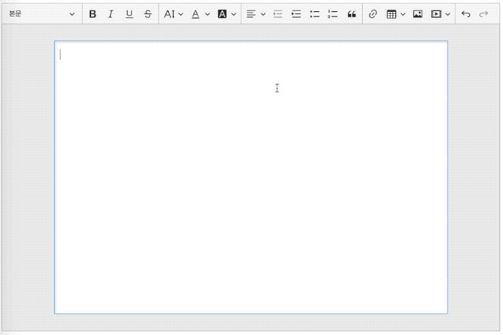

# ckeditor5 media align

Align feature for [ckeditor5-media-embed](https://github.com/ckeditor/ckeditor5/tree/master/packages/ckeditor5-media-embed).



## Usage

```js
// react example
import React, { Component } from "react";
import CKEditor from "@ckeditor/ckeditor5-react";
import ClassicEditor from "@ckeditor/ckeditor5-editor-classic/src/classiceditor";
import MediaEmbed from "@ckeditor/ckeditor5-media-embed/src/mediaembed";
import MediaToolbar from "@ckeditor/ckeditor5-media-embed/src/mediaembedtoolbar";
import MediaStyle from "@kimnagui/ckeditor5-media-align";
...

export default class Editor extends Component {
    <CKEditor
        ...
        editor={ClassicEditor}
        config={{
            ...
            plugins: [
                ...
                MediaEmbed,
                MediaToolbar,
                MediaStyle,
            ],
            toolbar: [
              ...
              "mediaEmbed",
              ...
            ],
            mediaEmbed: {
              ...
              toolbar: [
                "mediaStyle:full",
                "|",
                "mediaStyle:alignLeft",
                "mediaStyle:alignCenter",
                "mediaStyle:alignRight",
              ],
              styles: ["full", "alignLeft", "alignCenter", "alignRight"],
              locales: { // optional
                full: "your_translation",
                alignLeft: "your_translation",
                alignCenter: "your_translation",
                alignRight: "your_translation",
              },
            },
        }}
    />
```
